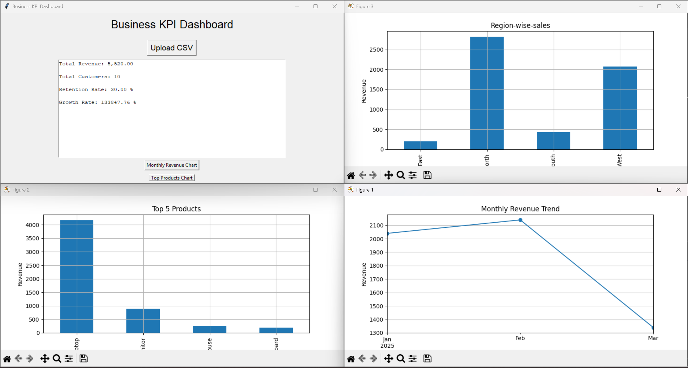

# 📊 Business KPI Dashboard

A professional Business KPI Dashboard built using Python, Tkinter, pandas, and matplotlib.

This application helps businesses analyze revenue, customer behavior, and product performance using interactive visualizations.

---

# 🚀 Features

- Upload sales dataset (CSV)
- Calculate Total Revenue
- Customer Retention Rate
- Growth Rate Analysis
- Monthly Revenue Trend Chart
- Top 5 Products Analysis
- Region-wise Sales Analysis
- Interactive GUI using Tkinter

---

# 🖼 Screenshots

## Dashboard Interface



---

# 🛠 Technologies Used

- Python
- Tkinter
- pandas
- matplotlib

---

# ▶ How to Run

```bash
pip install pandas matplotlib
python main.py
